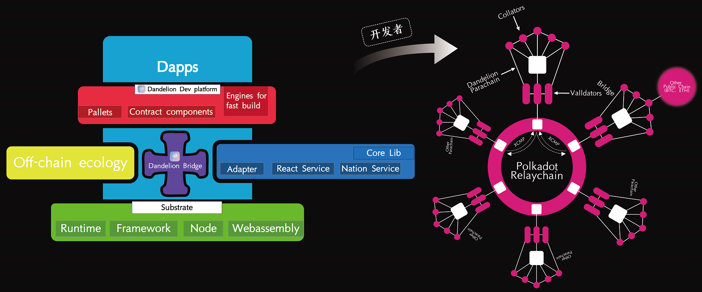

# Dandelion Network
try our best!

## 项目介绍

 Dandelion Network是基于Substrate打造的公益领域的跨链、可扩展和去中心化的应用程序开发平台。

Dandelion Network兼容全套EVM应用程序开发工具，例如Metamask、Truffle、Remix 等。为创业开发者提供覆盖开发、测试、调试、部署、监控、数据提供、模块调用和前端开发等阶段的DAPP全栈工具和服务支持。开发者可以轻松通过工具接入到Dandelion Network，创建和发布相关应用程序。

## 项目愿景

**成为全球基于公益事业最大的去中心化应用程序开发平台**

**解决问题:**  提供定制化的Dapp开发模块，降低公益区块链创业门槛，实现精准透明高效公益。

## **技术框架及技术架构**

Dandelion Network是基于Substrate打造的公益领域的跨链、可扩展和去中心化的应用程序开发平台，它有助于全球公益事业实现Web3.0跨越。

Dandelion Network 技术架构分为四层：Substrate、Dandelion Bridge、Dandelion Dev platform、Dapps。Dandelion Dev platform中为公益类Dapps提供的定制化功能模块库是我们的优势和研发重心——募捐模块、身份认证绑定模块、去中心化身份索引模块、公益物流数据上链模块、捐赠跨链模块、基金会抵押担保模块、公益借贷模块、利润定向公益模块、Token激励模块、DAO治理模块、创建NFT模块、抵押挖矿模块、数据监控查询模块、数据储存与传输模块、爱心贡献值贯通模块、账户管理模块等等。

## **团队信息：7人**

Dandelion Network是基于Substrate打造的公益领域的跨链、可扩展和去中心化的

**Francis.Yu** 联合创始人兼首席技术官：某研究院高级工程师，热爱编程技术，对密码学、算法了解，同时在区块链、智能合约方面也有开发经验，目前正致力于Dandelion Network的研发。

**Edison.Xia** 联合创始人兼首席执行官：在传统烘焙食品、金融和移动互联网有过相关创业经验，熟悉传统商业、互联网以及区块链项目的运营管理方式以及商业经济模型顶层设计。2011年开始接触公益，秉持“帮助他人，成就自我”的核心价值观处世。目前带领团队构建 DandelionDAO生态，致力于通过提供全方位的Web3.0技术和资源的支持从而实现公益世界与商业世界信任桥梁的搭建。

**John.Liu** 联合创始人兼首席公益官：原NGO机构对外负责人，曾在旅游、医疗等公共利益事业相关行业有过创业经历，11年公益达人，对公共利益事业革新有独到的见解，划时代进程中公益共识与区块链共识都很伟大。

**Xiami** 首席战略官：11年Java领域开发经验，全栈开发工程师，熟悉solidity开发。2016年介入区块链领域，参与LISK，NEO，CHAINX， NEAR，Polkadot等多个区块链项目社区协助运营，对波卡社区生态发展比较了解。自主创业NFT+DEFI项目，对项目孵化流程比较熟悉。

**Rob** 技术合伙人：某研究院专家，10年以上开发经验，业余rust开发，擅长数据库、C++。

**Yongbo.Li** 技术合伙人：4年前端开发经验，软件开发基础扎实，曾参与多个业务项目的开发，能够独立完成前端项目，熟悉vue与react等前端框架，对区块链技术有浓厚的兴趣及涉猎。

**Differs** 技术合伙人：5年rust使用开发经验，区块链开发工程师，熟悉substrate、以太坊智能合约开发。2017年进入区块链领域，研究过BTC,ETH,XMR等众多项目，目前最看好Polkadot。

> 靓文阅读： [DandelionDAO生态介绍.pdf](./docs/DandelionDAO生态介绍.pdf)
